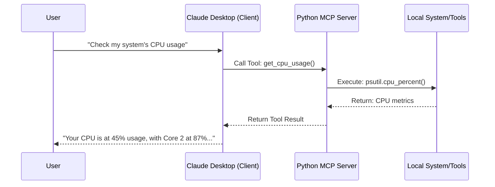

# DevOpsMCP-Server

# DevOps Diagnostics Server (MCP Server)

> **A comprehensive DevOps companion that connects LLMs directly to your local infrastructure and system diagnostics tooling.**

## 🚀 Overview
The **DevOps Diagnostics Server** is an implementation of the **Model Context Protocol (MCP)** that gives AI agents (like Claude) the ability to run system diagnostics and infrastructure audit tools directly on your local machine.

Instead of manually running diagnostic commands and copy-pasting output, this server allows AI to:
1. **Monitor** system resources (CPU, memory, disk, network)
2. **Analyze** running processes and services
3. **Inspect** logs and configuration files
4. **Validate** Infrastructure as Code (Dockerfiles, etc.)
5. **Diagnose** performance issues and bottlenecks

This project follows the **Shift-Left** philosophy: catching configuration errors and identifying issues on the developer's machine *before* they reach production.

---

## 🛠️ Available Tools

### System Monitoring
- **get_system_info()** - Comprehensive system information (OS, version, uptime, architecture)
- **get_cpu_usage()** - CPU usage metrics with per-core breakdowns
- **get_memory_usage()** - RAM and swap memory statistics
- **get_disk_usage(path)** - Disk space analysis for any path

### Process Management
- **list_processes(limit)** - List top processes by CPU usage
- **check_process_running(process_name)** - Verify if a process is running

### Network Diagnostics
- **check_port_listening(port, host)** - Check if a port is open and which process is using it
- **get_network_stats()** - Network interface statistics (bytes sent/received, errors)

### Log Analysis
- **read_log_file(path, lines, search_term)** - Read and filter log files with search capability

### File System Operations
- **get_directory_size(path)** - Calculate total size of directories
- **get_environment_variable(var_name)** - Inspect environment variables

### Infrastructure Validation
- **validate_dockerfile(path)** - Validate Dockerfiles using hadolint

---

## 🏗 Architecture
This project runs entirely on the local host to ensure data privacy and direct system access.



---

## 📦 Installation

### Prerequisites
- Python 3.8+
- pip (Python package manager)

### Install Dependencies

```bash
# Clone the repository
git clone https://github.com/JH-A-Kim/DevOpsMCP-Server.git
cd DevOpsMCP-Server

# Install Python dependencies
pip install -r requirements.txt
```

### Optional: Install hadolint for Dockerfile validation

If you want to use `validate_dockerfile()` tool, install hadolint:

**Using Homebrew/LinuxBrew:**
```bash
brew install hadolint
```

**Or download from:**
https://hadolint.com/

---

## 🚀 Usage

### Running the Server

```bash
python server.py
```

The server runs using stdio transport and can be integrated with MCP clients like Claude Desktop.

### Example Use Cases

**System Health Check:**
```
"Check my system's health - CPU, memory, and disk usage"
→ Returns comprehensive metrics for diagnostics
```

**Process Investigation:**
```
"Is nginx running? And what port is it listening on?"
→ Checks process status and port 80/443 listeners
```

**Log Analysis:**
```
"Show me the last 20 error lines from /var/log/app.log"
→ Filters and displays relevant log entries
```

**Infrastructure Audit:**
```
"Validate my Dockerfile for best practices"
→ Runs hadolint and reports security/optimization issues
```

---

## 🧪 Running Tests

```bash
# Run all tests
python -m unittest discover tests/ -v

# Run specific test file
python -m unittest tests/test_diagnostic_tools.py -v
```

---

## 📋 Tool Reference

### System Information Tools

#### get_system_info()
Returns OS type, version, architecture, hostname, uptime, and Python version.

**Example Output:**
```
=== System Information ===
Os: Linux
Hostname: server-01
Uptime: 5 days, 3:42:15
```

#### get_cpu_usage()
Returns overall and per-core CPU usage percentages.

#### get_memory_usage()
Returns RAM and swap memory statistics in GB.

#### get_disk_usage(path="/")
Returns disk space metrics for specified path.

**Parameters:**
- `path` (str): Path to check (default: "/")

### Process Tools

#### list_processes(limit=10)
Lists top processes sorted by CPU usage.

**Parameters:**
- `limit` (int): Number of processes to show (default: 10)

#### check_process_running(process_name)
Checks if a process is running and returns PIDs.

**Parameters:**
- `process_name` (str): Name of the process to search

### Network Tools

#### check_port_listening(port, host="127.0.0.1")
Checks if a port is listening and identifies the process.

**Parameters:**
- `port` (int): Port number to check
- `host` (str): Host to check (default: "127.0.0.1")

#### get_network_stats()
Returns network interface statistics including bytes sent/received.

### Log & File Tools

#### read_log_file(file_path, lines=50, search_term=None)
Reads and optionally filters log files.

**Parameters:**
- `file_path` (str): Path to the log file
- `lines` (int): Number of lines to return (default: 50)
- `search_term` (str): Optional search filter

**Features:**
- 10 MB file size limit for safety
- Tail functionality (last N lines)
- Search/filter capability

#### get_directory_size(path)
Calculates total size of a directory recursively.

**Parameters:**
- `path` (str): Directory path to analyze

#### get_environment_variable(var_name=None)
Retrieves environment variable values.

**Parameters:**
- `var_name` (str): Specific variable name (optional - returns all if omitted)

---

## 🔒 Security Considerations

- All file operations validate paths and check existence
- Log file reading has a 10 MB size limit to prevent memory issues
- Process and port checking use safe psutil APIs
- No shell injection risks - all operations use Python libraries
- Environment variable access is read-only

---

## 🤝 Contributing

Contributions are welcome! Please ensure:
1. All tests pass: `python -m unittest discover tests/ -v`
2. Code follows existing style (use `black` and `flake8`)
3. Add tests for new features

Run pre-commit hooks:
```bash
pre-commit install
pre-commit run --all-files
```

---

## 📄 License

See LICENSE file for details.

---

## 🛣️ Roadmap

Future enhancements may include:
- Docker container inspection and management
- Kubernetes cluster diagnostics
- Cloud provider integration (AWS, Azure, GCP)
- Security scanning with additional tools (Trivy, Grype)
- Performance profiling capabilities
- Automated remediation suggestions

---
